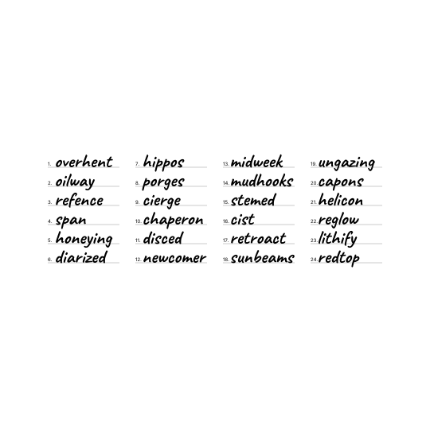
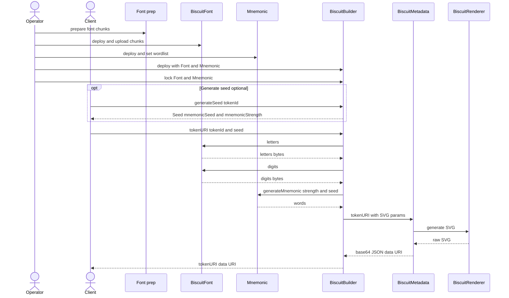

<div align="center">
  
  
  <h1>Biscuit</h1>
  <p><strong>Ethereum smart contracts that generate on-chain metadata</strong></p>
  
  
  
  
  
  
  
  
</div>

---

## What is Biscuit?

Biscuit is a project that generates pseudo mnemonic codes on-chain inspired by [BIP39](https://bips.dev/39/) and turns them into NFTs.

BIP39 describes how to add a checksum to entropy and map it to words from a fixed wordlist (commonly used as 12/24-word phrases).

<p><span style="opacity:0.7">⚠️ Warning: This project is for entertainment purposes only. <strong>Do not use it to generate real wallet mnemonics.</strong> The authors assume no responsibility for any losses resulting from use of this repository.</span></p>
<p><span style="opacity:0.7">Note: Some SVG previews may render correctly only in Chromium-based browsers.</span></p>

<div align="center">
  
</div>

## Quick Start

```shell
corepack enable
./start.sh
```

Manual steps:

```shell
pnpm install
pnpm fonts:prepare
pnpm hardhat compile
pnpm hardhat run tools/render-svg.mjs
```

Outputs are written to `outputs/`.

## Config

Copy `.env.example` to `.env` and fill:

- `SEPOLIA_RPC_URL`
- `SEPOLIA_PRIVATE_KEY` (never commit this or use a wallet with real funds)

Hardhat loads `.env` automatically via `dotenv/config`.

## Architecture

<pre><code>biscuit/
├── .github/          # GitHub configuration
│   └── workflows/    # CI workflows
├── artifacts/        # Hardhat build artifacts
├── assets/           # Fonts, wordlists, and branding assets
│   ├── branding/     # README images
│   ├── fonts/        # Font sources and subsets
│   │   ├── caveat/   # Caveat font files
│   │   └── inter/    # Inter font files
│   └── mnemonic/     # Wordlists for mnemonic generation
├── cache/            # Hardhat compiler cache
├── contracts/        # Solidity contracts and libraries
│   ├── interfaces/   # Contract interfaces
│   ├── libs/         # Shared libraries (rendering, utils)
│   └── test/         # Solidity test harnesses
├── ignition/         # Hardhat Ignition modules
├── test/             # TypeScript/Node tests
│   └── integration/  # Integration tests
├── tools/            # Node/Hardhat developer utilities
└── outputs/          # Local outputs (generated SVGs, scratch files)
</code></pre>

## Sequence



## License

GPL-3.0 - see [LICENSE](LICENSE).
